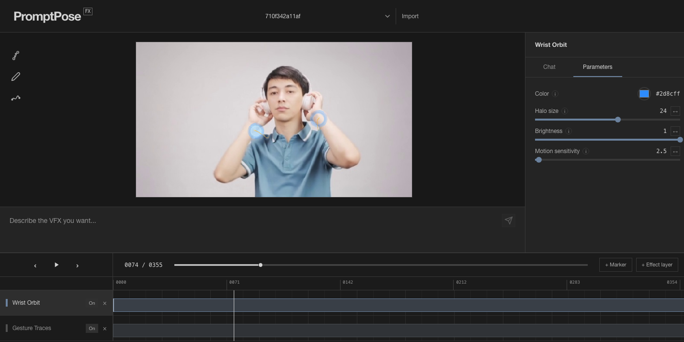

# PromptPoseFX

An AI-assisted video editor for creating pose-driven visual effects with natural language and direct canvas/timeline controls.



*Two generated Effects: wrist halos and Pose-history traces. Video and Effect data are not included in the repository.*

## What you can do

- Generate or revise effects through chat; clarify ambiguous requests with selectable options.
- Set precise references with Pose joints, Points, Paths, and Time Markers.
- Edit multiple Effect tracks, adjust parameters, and toggle layers without deleting them.
- Reuse a saved Effect's visual behavior by explicitly referencing it with `@`.

## How it works

```text
Video upload ──> 30 FPS frames ──> MediaPipe Pose ──> smoothed joint timeline
                                      │
Chat + selected Points/Paths/Markers ──> MainAgent (intent and clarification)
                                      │
                                      ├──> direct parameter/name update
                                      └──> CodeAgent ──> validation ──> Effect Repository
                                                               │
Video frame + Pose + Effect controls ──────────────────────────> p5.js preview
```

MainAgent resolves intent and clarification; CodeAgent generates code only when needed. Generated Effects pass validation before activation, while parameter and name changes use direct updates. A single playback clock keeps the timeline and canvas synchronized. Effects are stored locally.

## Tech stack

| Area | Technology |
| --- | --- |
| Editor | React 19, Vite, Tailwind CSS 4 |
| API and agents | FastAPI, LangGraph, OpenAI-compatible model API |
| Pose processing | MediaPipe Pose, OpenCV, NumPy |
| Effect rendering | p5.js on a canvas over the video frame |
| Progress updates | HTTP API and Server-Sent Events |

## Run locally

Requirements: Python 3.10.16, Node.js 20.19+ (see `.python-version` and `.nvmrc`), and an API key for OpenAI or a compatible Chat Completions endpoint. The first video upload performs local pose processing; creating or editing an Effect with AI uses the configured model API and may incur charges.

1. Copy `.env.example` to `.env` and set `OPENAI_API_KEY`. If using a compatible gateway, also set `OPENAI_API_BASE` and model names supported by that gateway. The repository ignores `.env`.
2. Start the backend from the repository root:

   ```bash
   python3.10 -m venv .venv
   source .venv/bin/activate
   python -m pip install -r vfx-agent-backend/requirements-dev.txt
   cd vfx-agent-backend
   python app.py
   ```

3. In a second terminal, start the frontend from the repository root:

   ```bash
   nvm install
   nvm use
   cd frontend
   npm ci
   npm run dev
   ```

Open `http://localhost:5200`. The frontend proxies `/api/*` to the backend on port 5800. Upload a video from the top bar and wait for pose processing to finish before creating an Effect. The frontend does not ship with a sample video or pre-generated Effects.

## Verify

From `vfx-agent-backend/` with the Python environment active:

```bash
python -m pytest -q
```

From `frontend/`:

```bash
npm test
npm run lint
npm run build
```

These are the offline checks run by CI. Tests marked `live` are excluded by default because they call a real model endpoint and may incur API costs.

## Repository layout

```text
frontend/           React editor, canvas overlays, playback, and UI tests
vfx-agent-backend/  FastAPI service, agents, pose pipeline, storage, and tests
shared/             Control-resolution runtime shared by preview and validation
.github/workflows/  Offline CI checks
```

Local videos, generated Effects, logs, model files, and checkpoints are ignored by Git.

## Current limitations

- Pose is the primary visual input. The agent cannot reliably inspect clothing color, scene objects, or occlusion from video pixels.
- Uploaded videos are extracted at a target of 30 FPS and resized to 640×360 for processing and preview; original aspect ratio and resolution are not preserved.
- Effects are previewed in the editor. There is no finished-video export workflow yet.
- The app is designed for local use; it does not provide accounts, multi-user collaboration, or a hosted deployment.
